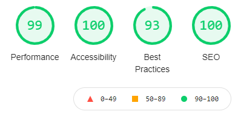

# ALTKD - Académie Lamottoise de taekwondo

## Évaluation d'entrainement :

Réalisation d'un site statique pour une association

Version: GDWFSHTMLCSSBOOTEXAIII1A


### Livrable attendu pour l’examen de ce bloc

Création d’un petit jeu sur navigateur web à l’aide du DOM.
En fin de prestation, le commanditaire doit recevoir les différents éléments suivants :
- Un jeu fonctionnel
- Une interface lisible qui correspond à la maquette fournie.
Ceci implique plusieurs fonctionnalités globales :
En front-desk (côté client) :
- La possibilité de créer une nouvelle partie
- La possibilité de retenir le score courant
- La possibilité de lancer le dé
- La possibilité d’avoir 2 joueurs

### Contexte du projet

Un site internet présente de nombreux intérêts pour une association, surtout en termes de visibilité (c’est
à vous de choisir une association, qu’elle soit réelle ou fictive, l’important sera votre code).
Le site devra au minimum contenir 2 pages :

• Une page relative à l’association.

• Une page publicitaire des événements à l'échelle national (Vous choisissez le thème de l’événement, la
date, les détails).

Bien entendu le site devra être responsive et à la demande du client l'interface devra être pensée mobile
first !

## Environnement de développement

Environnement système : Windows 10

Editeur : VS Code 

```bash
npm install bootstrap
npm install bootstrap-icons
npm i -g purgecss
    -> purgecss --css feuille_de_style --content liste_des_pages_html --output fichier_de_sortie
```

## Rendu final


## Résultats des tests lighthouse




